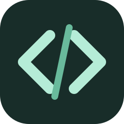

<p align="center">
  
</p>

# Sidekick

A local coding assistant with a full conversation workspace and a compact, always-on-top desktop HUD. Sidekick connects to Ollama and gives compatible models project tools, saved conversations, task tracking and optional web research.

The native app targets **Windows**. A local browser interface and Docker Compose configuration share the same agent backend.

## Features

- **Two views:** a full workspace for longer sessions and a minimal HUD for working alongside other applications.
- **Project tools:** list, read, search, create, edit and move text files, with diffs, conflict checks and recoverable backups.
- **Command approval:** inspect each proposed command and choose **Run once** or **Deny**.
- **Saved work:** persistent chats, project task lists and a tool for searching earlier project conversations.
- **Automatic compaction:** summarize older context while retaining the original saved messages.
- **Adjustable context:** a persistent 2K–256K token slider, in 2K steps, with a 32K interface default.
- **Research and vision:** optional web search with source links, plus manually attached screen captures for vision-capable models.
- **Streaming:** responses, tool activity and model-provided reasoning when supported.

## Run the Windows app from source

Prerequisites: Python 3.12, Ollama running locally, and Microsoft Edge WebView2 Runtime. Install a model appropriate for your available memory. Coding actions require a model that reports tool support; screen captures require vision support.

From the repository directory in PowerShell:

```powershell
python -m venv .venv
& ./.venv/Scripts/python.exe -m pip install -r requirements-desktop.txt
& ./.venv/Scripts/python.exe desktop.py
```

Ollama is a separate service. Use `ollama list` to check its installed models. You can download a model using `ollama pull <model-name>` (replace the placeholder), or use Sidekick's model controls.

Open **Projects → Add folder**, choose an existing project folder and select a model. Then ask for a concrete task, such as:

> Inspect this project, create a short task list, then fix the first issue and run the relevant checks.

See [QUICKSTART.md](QUICKSTART.md) for everyday controls.

## Build a portable Windows app

Run from a PowerShell session that permits local scripts:

```powershell
./build.ps1
```

The script creates a virtual environment, installs the pinned desktop dependencies and builds `dist/Sidekick/Sidekick.exe` with PyInstaller. Distribute the **entire `dist/Sidekick` directory**; its `_internal` directory must remain beside the executable. This is a portable application folder, not an installer or a single self-contained executable.

The portable build stores its data in the normal application-data directory described below. Its saved conversations do not automatically travel with the executable folder.

## Run in a local browser

With Ollama running, install `requirements.txt` in a Python virtual environment and start the server:

```powershell
python -m venv .venv
& ./.venv/Scripts/python.exe -m pip install -r requirements.txt
& ./.venv/Scripts/python.exe model_manager.py
```

Open **http://localhost:8081**. The browser interface supports chat, project tools, tasks and saved memory. Native screen capture and operating-system always-on-top controls require the Windows app.

The server is intended for local use. It binds to loopback by default and checks API host/origin headers. It does not provide user accounts or an authentication layer for public hosting.

## Docker Compose

The supplied Compose file runs the interface and a separate Ollama service. **Container execution and GPU acceleration have not been validated.** The configuration does not request GPU access.

Select an existing host project directory and start the services. In PowerShell:

```powershell
$env:SIDEKICK_WORKSPACE = (Resolve-Path ./workspace).Path
docker compose up --build -d
```

Replace `./workspace` with the folder you want to use; it must already exist for `Resolve-Path`. Without `SIDEKICK_WORKSPACE`, Compose defaults to a `workspace` directory beside the source.

Container Ollama has its own model volume. Download a model into it using `docker compose exec ollama ollama pull <model-name>` (replace the placeholder), or use the interface's model controls. Models installed in a host Ollama service are not automatically shared with the container.

Open **http://localhost:8081**, then add `/workspace` as a project. The selected host directory is mounted there, and browser project selection is restricted to that mount. File edits affect the mounted host files.

Compose publishes ports 8081 and 11434 on loopback only. If a host Ollama already uses port 11434, stop that conflicting service or adjust the Compose port mapping before starting. Named volumes retain application data and container model downloads. Use `docker compose down` to stop the services without removing those volumes.

## Context, memory and model support

Set **Settings → General → Context window** to choose 2,048–262,144 tokens. This budget includes instructions, tools, conversation and reply. Sidekick reserves response space and passes the selected window to Ollama for agent steps. A choice above the model's reported context maximum is rejected. Small windows may be insufficient for project tools; large windows require more memory and can make inference slower. Selecting 256K does not guarantee that a model or machine can use it effectively.

When the active conversation grows, older context is summarized by the local model. Summaries are stored separately, original messages remain available, and a failed compaction does not replace the previous summary. Summaries can omit details. Compaction inference uses a window no larger than 16K or the model's lower supported limit.

The `search_memory` tool searches user and assistant text in up to the 100 most recently updated chats for the selected project, returning up to eight matching snippets. It does not automatically load every previous conversation. Task lists persist between sessions but do not schedule background work.

Model output and tool use depend on the selected model. Reasoning display shows text supplied by that model; it is not a guarantee that an answer or action is correct.

## Files, commands and recovery

File tools are scoped to the selected project and reject traversal outside it, `.git` internals, symbolic links, junctions, hard-linked files, Windows device paths and alternate data streams. Text files are limited to 2 MiB, with bounded scans and output. Sensitive files inside the project, including `.env` files, are accessible to the model through these tools.

**Allow edits in the selected project** is enabled by default and can be disabled in General settings. Existing-file changes save previous content outside the project and check for conflicting edits. Tool results include diffs and backup IDs. Ask Sidekick to restore a backup by its ID. Restoring a file creation removes the created file; restoring a move recreates the original path and leaves the moved copy at its destination. Directory creation does not have a content backup.

Every command requires approval of its displayed arguments and working directory. **Approved commands have the host account's normal permissions; a working directory is not a process sandbox.** They can access other files or the network. Commands have a maximum 60-second runtime and bounded output. Deny or Stop cancels a pending approval. Agent runs also have a bounded number of steps; continue with a follow-up prompt when needed.

## Data and network behavior

With the default local Ollama endpoint, prompts, selected project content and screen attachments are processed by that local service. `OLLAMA_API_BASE` can point to a different Ollama endpoint, in which case that endpoint receives the requests.

Web research is optional. When enabled, model-generated search queries go to public search services through `ddgs`, and results contain snippets and source URLs. Sidekick does not provide interactive browser automation or full-page extraction. Model downloads also require network access. Approved programs may use the network independently.

Screen capture is user-triggered and attaches a preview of the primary display. Sidekick does not continuously monitor the screen or autonomously control arbitrary applications and browser tabs.

By default, Windows state lives under `%LOCALAPPDATA%\Sidekick`:

| Location | Contents |
| --- | --- |
| `sidekick.sqlite3` | Projects, tasks, conversations, attachments, settings and compaction summaries |
| `backups/` | Saved file versions and backup manifests |
| `sidekick.log` | Rotating desktop error log |
| `webview/` | Native interface browser state |

Set `SIDEKICK_DATA_DIR` before launch to choose another directory. On systems without `LOCALAPPDATA`, the storage backend defaults to `~/.local/share/sidekick`. In Compose, application data is stored in the `sidekick-data` volume mounted at `/data`.

Data is not encrypted by Sidekick. Close the app before copying the entire state directory for a consistent backup. Completed messages and normally stopped partial responses are saved; a hard crash can lose text still streaming. Keep these data directories, logs and backups out of Git.

## Development

See [CONTRIBUTING.md](CONTRIBUTING.md) for test setup and repository hygiene.

| File | Responsibility |
| --- | --- |
| `desktop.py` | Windows native host and UI bridge |
| `frontend/index.html` | Shared interface |
| `model_manager.py` | Local browser HTTP server |
| `core.py`, `runtime.py` | Ollama requests and background jobs |
| `agent_runtime.py`, `service.py` | Agent loop and shared application actions |
| `project_tools.py`, `tool_calls.py`, `recovery.py` | Project tools, command handling and recovery |
| `storage.py`, `context_window.py` | Persistence and context budgeting |

If models are missing, start Ollama and use **Settings → Models → Refresh models**. Initial model loading can delay the first token. If reasoning consumes the response allowance, disable **Show model reasoning** or increase **Response length**. Desktop startup and window errors are recorded in `sidekick.log`.
