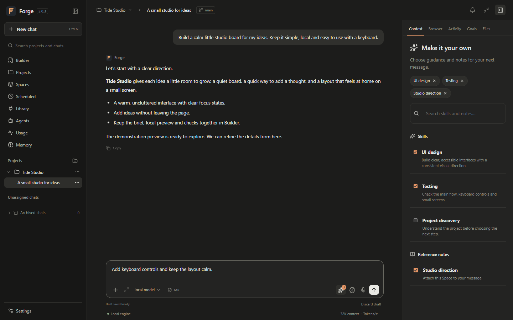
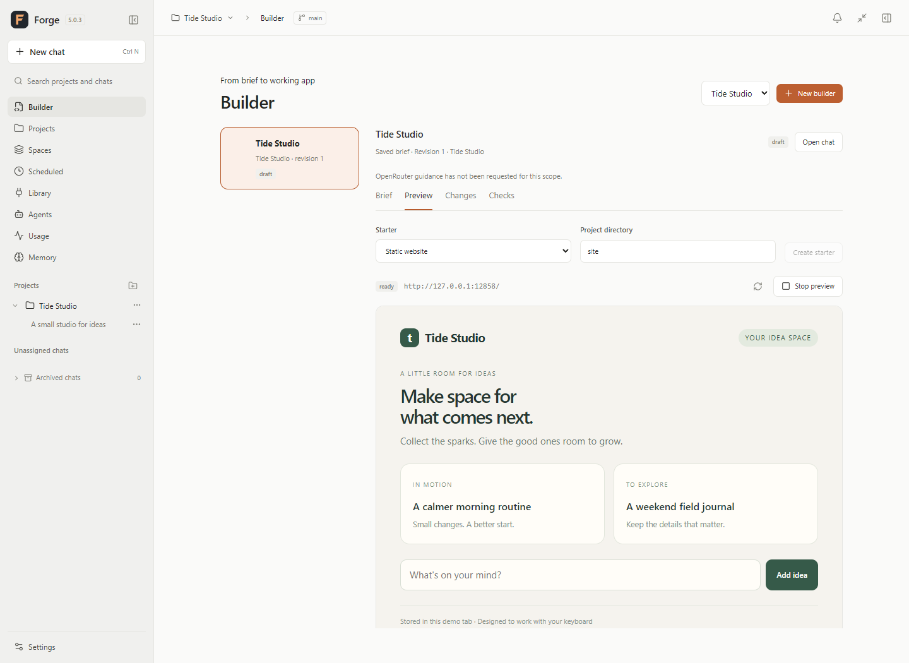
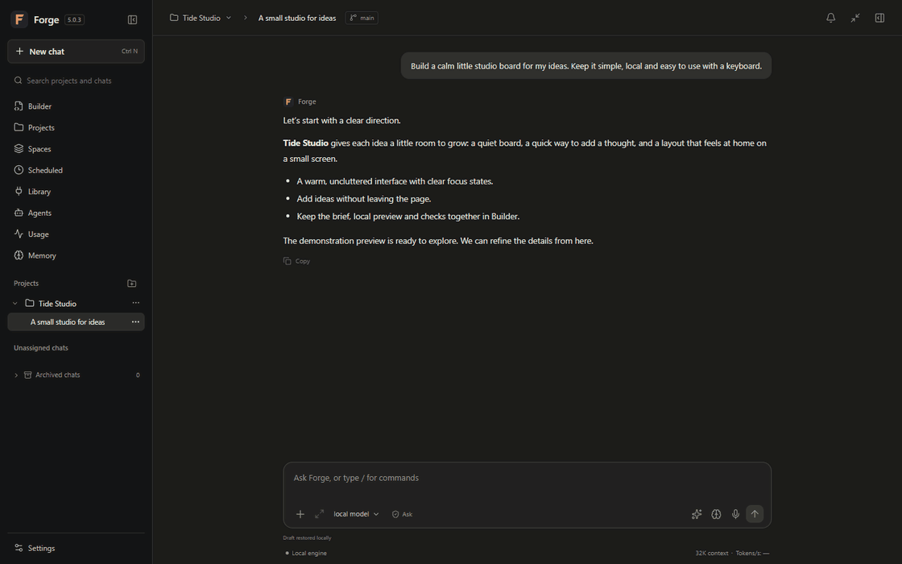
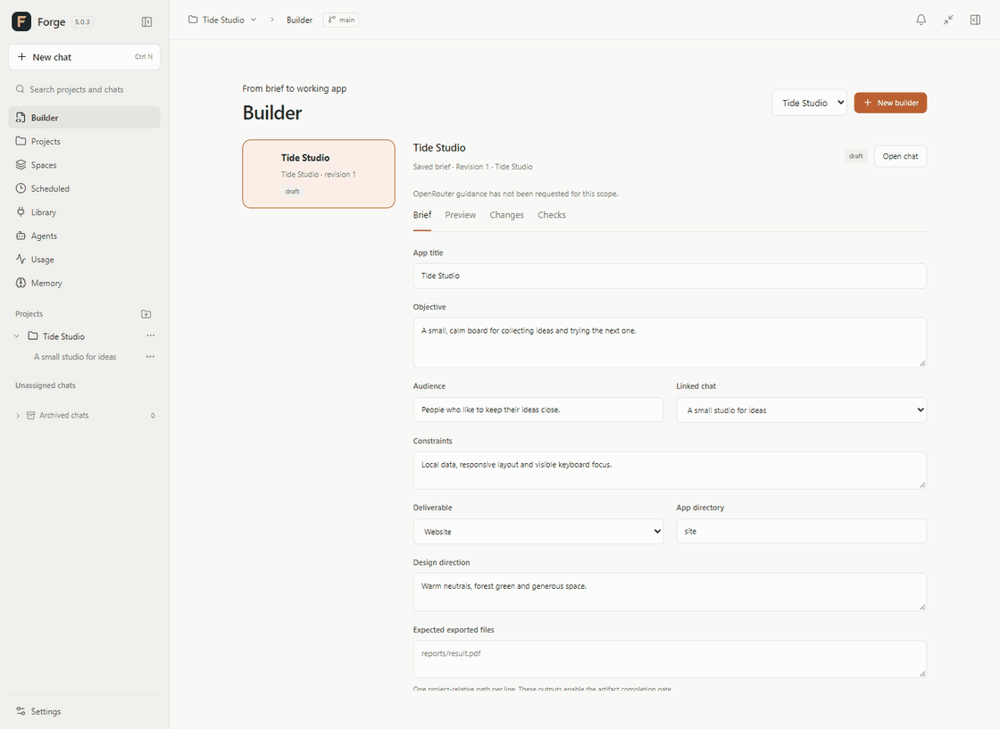

# Forge 5.0.4

Your models. Your projects. Your workspace.

Forge is a local AI workspace for building apps, exploring ideas and working with
files on your computer. It brings chat, Builder, previews and project tools into
one Windows app. Optional OpenRouter guidance helps with planning and review.

**[Download the Windows installer](https://github.com/Bh0ps/forge-local-ai/releases/download/v5.0.4/Forge-5.0.4-Setup.exe)**
· [Release notes](https://github.com/Bh0ps/forge-local-ai/releases/tag/v5.0.4)
· [Checksum](https://github.com/Bh0ps/forge-local-ai/releases/download/v5.0.4/SHA256SUMS.txt)

## Install

1. Install [Ollama](https://ollama.com/download/windows) and choose a local model.
2. Download **Forge-5.0.4-Setup.exe** and run it.
3. Open Forge and follow the setup wizard to connect your model.

Windows 10/11, 64-bit, with WebView2 is required. Python, Node.js and the source
repository are not needed. The installer creates shortcuts and updates the app
while preserving your local chats, projects and model selections.

This Windows preview is unsigned; the release includes a SHA-256 checksum.
Automatic installation stays disabled until a trusted signing publisher is set
up. Ollama and model downloads are separate. No cloud account is required.

## Make it your own

- Talk to a local model and connect the project folders you choose.
- Start with **`/builder`**, shape a brief, then use **`/build`** to implement it.
- Keep the app preview, changes and checks alongside the work.
- Attach skills and reference notes to guide the next message.
- Pause and resume tracked work with saved checkpoints.
- Use the compact HUD when you want Forge close by.

## A look inside

These images and animations use an isolated demo workspace with synthetic data.

Watch the workspace and Builder in action

Attach guidance for your next message:

Move from the brief to the preview and checks:

## Connect a browser or Telegram

The [Chrome and Edge extension](browser-extension/README.md) lets you explicitly
connect a tab, see its connection status, disconnect or reconnect. Forge's built-in
browser and local Builder preview are also available without the extension.

For Telegram, open **Settings → Connected workflows**, add your bot, connect and
pair your account. Enable **Include response content** to receive the answer and
continue the conversation. Keep Forge and your computer running.

Use `/model` to see your selection, `/model list` to see available models, and
`/model <name or number>` to switch. `/reasoning` shows the current setting;
`/reasoning on` or `/reasoning off` changes it where the model supports that control.
Use `default` with either command to return to the configured defaults. Settings
are saved for that Telegram chat and apply to its next request or safe resume.

Start with **Always Ask** and approve actions you understand. Credentials stay in
the OS vault. Optional OpenRouter helpers use free routes with no paid fallback.

## Develop from source

Forge uses Python 3.12, React/TypeScript, SQLite and WebView2. Use Node.js 24.18.0.
See [Contributing](CONTRIBUTING.md) for setup and tests; `build.ps1` builds the
Windows app. Generated packages, private workspaces and local evidence stay out
of the source repository.

[MIT license](LICENSE) · [Security policy](SECURITY.md)
· [Third-party notices](THIRD_PARTY_NOTICES.md)
