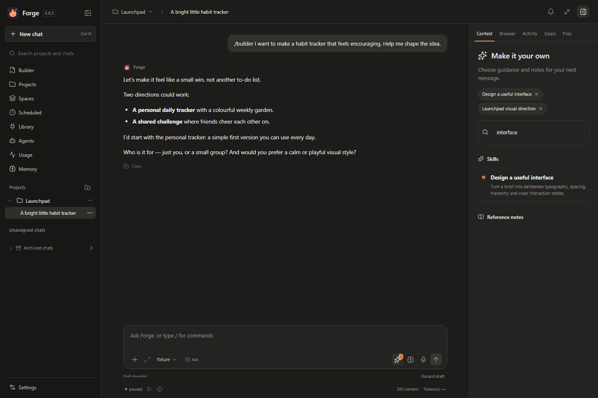
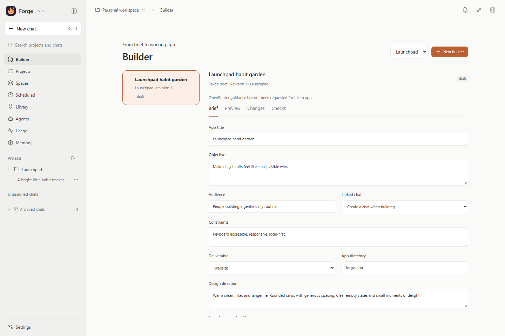

# Forge 5.0.2

A local AI workspace for building apps, working on projects and developing ideas.
Your models run locally. Optional OpenRouter guidance, Telegram and browser
connections extend the same workspace.

**[Download the Windows installer](https://github.com/Bh0ps/forge-local-ai/releases/download/v5.0.2/Forge-5.0.2-Setup.exe)**
· [Release page](https://github.com/Bh0ps/forge-local-ai/releases/tag/v5.0.2)
· [Older releases](https://github.com/Bh0ps/forge-local-ai/releases)

## Install

1. Install [Ollama](https://ollama.com/download/windows) and choose a local model.
2. Download **Forge-5.0.2-Setup.exe** above and run the installer.
3. Open Forge and follow its setup wizard to connect Ollama and select your model.

Windows 10/11, 64-bit, with the Microsoft Edge WebView2 runtime is required.
Python, Node.js and the repository's source files are not needed to use the installer.
The installer keeps the application files together and adds a Start menu shortcut.
An update preserves your local chats, projects, credentials and model selections.

This Windows preview is unsigned. The release provides a SHA-256 checksum;
automatic installation remains disabled until a trusted signing publisher is set up.
Model downloads are separate and can be large. No cloud account is required.

## What you can do

- Chat with local models and work on connected project folders.
- Develop an idea with **`/builder`**: get suggestions and answer a few questions
  at a time. **`/build`** accepts the proposal in a connected project.
- Use Builder's brief, preview, changes and checks to follow implementation.
- Select skills and reference notes through the sparkle icon beside the brain.
- Pause and resume tracked work from compact controls below the composer.
- Use 24 built-in workflows, project tools, document inputs and verified exports.
- Ask optional free OpenRouter planners and reviewers for guidance.

## Telegram and browser

In **Settings → Connected workflows**, add your Telegram bot, use **Connect / Test**,
pair your account and enable **Include response content** for conversation replies.
You receive the actual answer and can continue the conversation remotely. Native
commands include `/builder`, `/build`, `/plan`, `/goal`, `/answer`, `/status`,
`/pause`, `/resume`, `/cancel` and `/help`. Keep Forge and the computer running.
Building requires a connected project; brainstorming does not.

To connect a selected Chrome or Edge tab, follow the
[browser extension setup](browser-extension/README.md). The extension controls
only tabs you explicitly connect. The native browser is also available in Forge.

Start with **Always Ask** and approve actions you understand. Credentials stay in
the OS vault. OpenRouter is optional and uses validated free routes with no paid
fallback; provider quotas and availability still apply.

## Screenshots

These screenshots use disposable demonstration data.

## Develop from source

Forge uses Python 3.12, React/TypeScript, SQLite and WebView2. Use Node.js 24.18.0
for the frontend. See [contributing](CONTRIBUTING.md) for setup and tests.
Backend tests live in `tests/`; frontend tests live alongside the frontend source.
Build the Windows app with `build.ps1`. Local state, internal notes, evidence,
logs, credentials and generated packages stay outside the public source tree.

[MIT license](LICENSE) · [Security policy](SECURITY.md)
· [Third-party notices](THIRD_PARTY_NOTICES.md)
