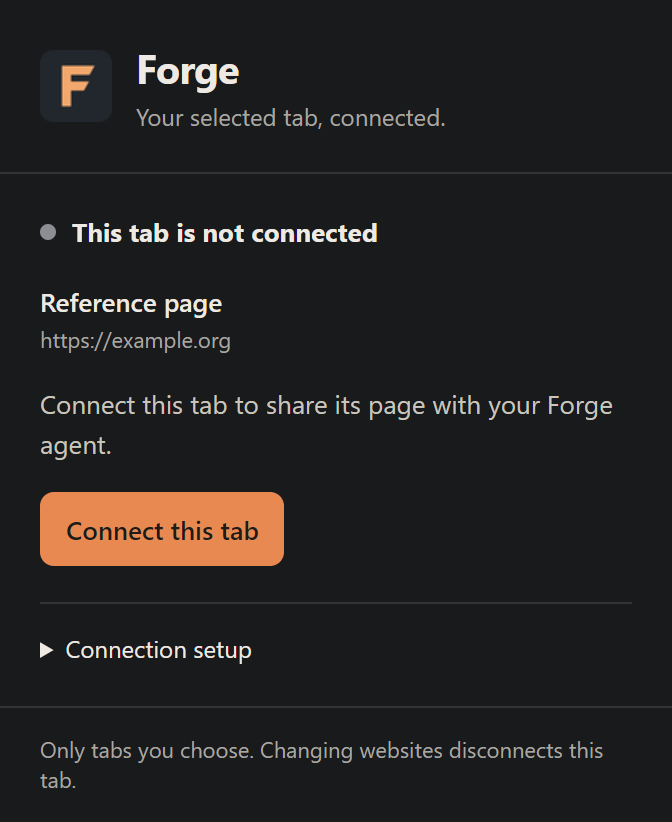

# Forge browser bridge

The extension uses `activeTab`, so it sees only a tab explicitly connected by
opening its toolbar popup and choosing **Connect this tab**. Use **Disconnect**
in that popup to revoke the selection. A cross-origin navigation
requires reconnecting. It does not import browser credentials or automate login.

1. In Forge desktop, open Settings → Browser and enable **Browser bridge**.
2. In Chrome or Edge's Extensions page, enable Developer mode and load this folder
   using **Load unpacked**. Choose Forge's bundled `browser-extension` folder
   (inside the installed app's `_internal` folder). Copy the generated extension ID.
3. In Forge, choose **Register native host** and paste that ID. Forge locates the
   bundled `ForgeBrowserHost.exe` automatically. Register each browser's extension
   ID if Chrome and Edge display different IDs.
4. Open the Forge extension popup on a tab and choose **Connect this tab**.
   The popup shows the selected website, connection state and setup instructions.
   **ON** means Forge acknowledged the connection; **…** means it is connecting;
   **!** means the bridge needs attention. A missing or unregistered native host
   shows the extension ID and the exact registration step.
5. Use **Reconnect Forge** after fixing setup or restarting Forge. A previously
   working native connection retries automatically with bounded backoff. It keeps
   your selected tabs in memory for the current browser session and never replays
   dispatched actions. Use **Disconnect** when you finish.

Source builds can produce the host with:

```powershell
python -m PyInstaller --onefile --name ForgeBrowserHost browser_tools.py
```

Native host registration writes only the current user's Chrome/Edge native
messaging registry keys. Only explicitly registered extension IDs are accepted.
Each native-host session gets a separate tab namespace, so Chrome and Edge cannot
collide even if their numeric tab IDs match. Agent actions require a fresh
inspection in the same run. Inspection includes associated field labels, current
values, dropdown options and viewport/scroll position. Guarded actions support
clicks, text fields, dropdown selection, supported key events (including form
submission with Enter) and bounded scrolling. Inspect again after each action.
Disconnecting or changing a selected website renews the native-host session;
use `browser_tabs` and inspect again to get fresh tab IDs and snapshots.
Password/file field values are excluded; those fields and stale or disabled targets
are rejected; a dispatched action is never automatically repeated after Stop.

Only explicit tab selections are retained in session storage; they are cleared
when the browser session ends. The extension does not request access to all tabs
or websites, scan browsing history, or keep a persistent list of visited pages.
Preview session IDs belong to `preview_*` tools and must never be supplied as a
browser `tab_id`; connected tab IDs come from `browser_tabs`.

No Chromium download is needed for this extension or Forge's native Browser
panel. Optional isolated Playwright browsing is a separate connection.

## Connection popup

Synthetic demo of the selected-tab controls:


